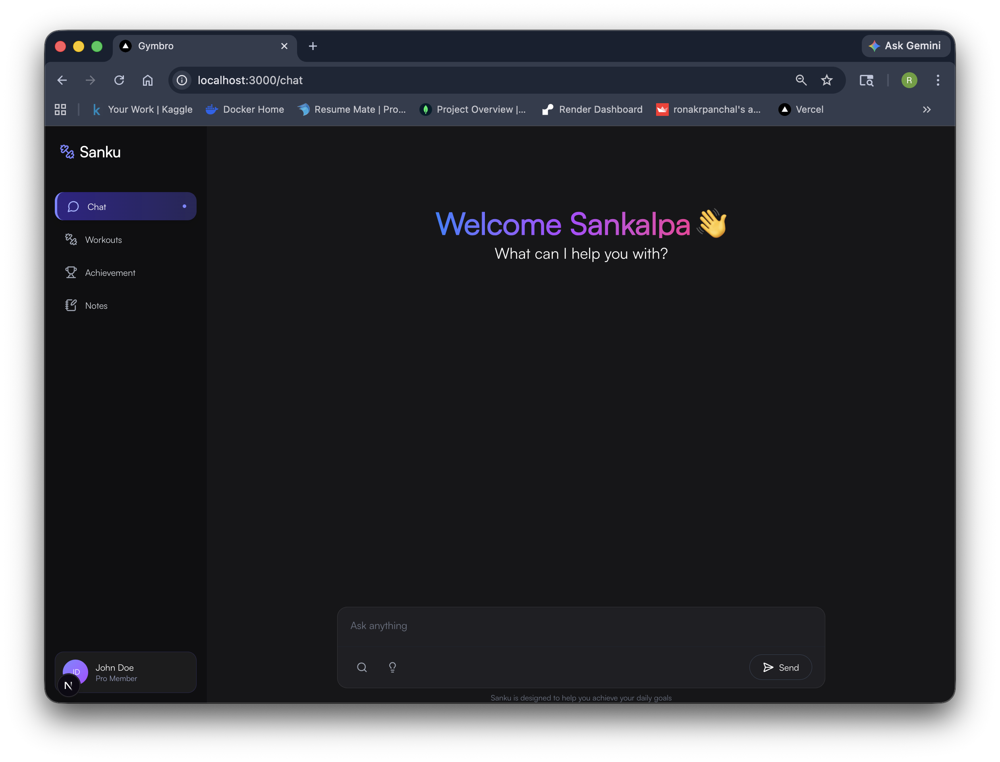

<div align="center">

# Sanku

</div>
<div align="center">


</div>
Sanku is an AI-powered everyday companion that helps you stay focused, organized, and consistent across your goals. This repository contains the frontend built with Next.js, TypeScript, Tailwind CSS, and a modern UI stack.

## Table of Contents

- [About](#about)
- [Features](#features)
- [Preview](#preview)
- [Tech Stack](#tech-stack)
- [Getting Started](#getting-started)
- [Environment Variables](#environment-variables)
- [Available Scripts](#available-scripts)
- [Contributing](#contributing)
- [Contributors](#contributors)

## About

The frontend includes:

- A landing page for product messaging and onboarding.
- A login flow that redirects users to backend auth.
- A chat interface for interacting with your AI companion.
- Dedicated modules for different goal areas, including workout and daily planning experiences.

It is designed as a clean UI layer that communicates with a backend API.

## Features

- AI chat interface for guidance, accountability, and planning.
- Google sign-in flow via backend redirect.
- Responsive, component-driven UI with reusable primitives.
- Theme support via `next-themes`.
- Motion and transitions using `framer-motion`.

## Preview



### Demo Links (Placeholders)

- Live demo: `TBD`
- Product walkthrough video: `TBD`

## Tech Stack

- [Next.js 15](https://nextjs.org/)
- [React 19](https://react.dev/)
- [TypeScript](https://www.typescriptlang.org/)
- [Tailwind CSS v4](https://tailwindcss.com/)
- [shadcn/ui + Radix UI](https://ui.shadcn.com/)
- [Framer Motion](https://www.framer.com/motion/)

## Getting Started

### Prerequisites

- Node.js 18+ (recommended latest LTS)
- pnpm (recommended)

### Installation

```bash
git clone <your-repo-url>
cd sanku-frontend
pnpm install
```

### Run Development Server

```bash
pnpm dev
```

Open [http://localhost:3000](http://localhost:3000).

## Environment Variables

Create a `.env.local` file in the project root:

```env
NEXT_PUBLIC_BACKEND_URL=http://127.0.0.1:8000
```

This value is used by the frontend API helper to call backend endpoints such as `/login` and `/chat`.

## Available Scripts

- `pnpm dev` - start development server (Turbopack)
- `pnpm build` - create production build
- `pnpm start` - run production server
- `pnpm lint` - run lint checks


## Activity


## Contributing

Contributions are welcome.

1. Fork the repository.
2. Create a feature branch.
3. Commit your changes.
4. Open a pull request.

## Contributors

<a href="https://github.com/ronakrpanchal/sanku-frontend/graphs/contributors">
  
</a>